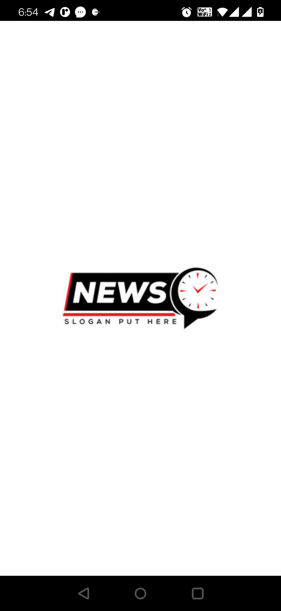
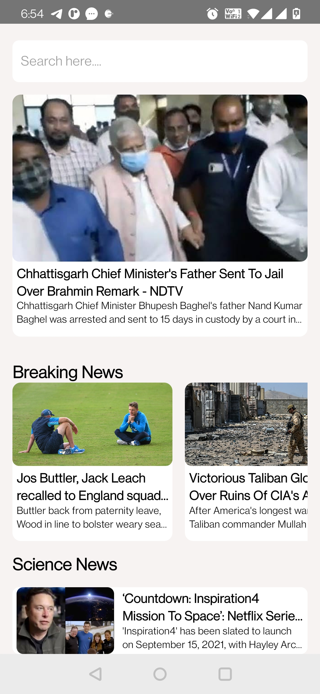

# React-Native-NewsApp

1. React-Native News App with native flash screen.
2. Custom resuable Components.
3. FlatList, API calls via fetch/Axios.
4. Use of Hook State and UseEffect.
5. API used is https://newsapi.org/

Screenshots:

     &nbsp;&nbsp;&nbsp;  
    

     

     &nbsp;&nbsp;&nbsp;  
    

     

     
    

     

